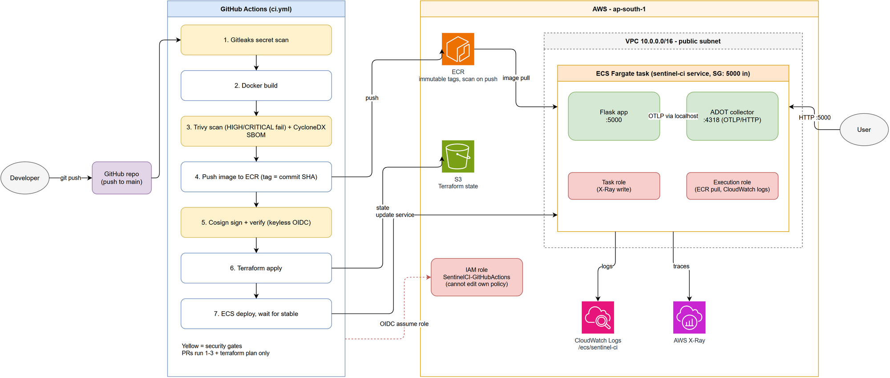

# SentinelCI

A small Flask app that I use as a guinea pig for building a "proper" CI/CD pipeline on AWS. The app itself is boring on purpose (two endpoints). The interesting part is everything around it: secret scanning, vulnerability scanning, signed images, infrastructure as code, and tracing.

I built this to learn how the pieces fit together end to end, so some choices are more "what I wanted to try" than "what you'd do in production". I've tried to be honest about those in the [Known rough edges](#known-rough-edges) section.

## What it does

Every push to `main` goes through this:

1. **Secret scan** with Gitleaks (the whole git history, not just the latest commit).
2. **Build** the Docker image.
3. **Scan** it with Trivy. HIGH or CRITICAL findings (that have a fix available) fail the build.
4. **Generate an SBOM** (CycloneDX) and upload it as a build artifact.
5. **Push** the image to ECR, tagged with the commit SHA.
6. **Sign** the image with Cosign (keyless, using GitHub's OIDC identity) and then verify the signature.
7. **Terraform apply** to create/update the AWS infrastructure.
8. **Deploy** to ECS Fargate and wait for the service to become stable.

Pull requests run steps 1 to 4 plus a `terraform plan`, but don't push, sign or apply anything.

## Architecture



Editable source: [`docs/architecture.drawio`](docs/architecture.drawio) (open in [draw.io](https://app.diagrams.net)).

The app and the OpenTelemetry collector run as two containers in the same Fargate task, so they share a network namespace and the app can just send traces to `localhost:4318`. The collector forwards them to X-Ray.

## Repo layout

```
.
├── app/                  Flask app + OpenTelemetry setup
│   ├── app.py
│   ├── telemetry.py
│   └── requirements.txt
├── otel/                 Collector config (also embedded into the task definition)
├── terraform/            All the AWS infrastructure
│   ├── networking.tf     VPC, public subnet, internet gateway, routes
│   ├── security.tf       Security group (port 5000 in, everything out)
│   ├── ecr.tf            ECR repo (immutable tags, scan on push)
│   ├── ecs.tf            Cluster, task definition, service, task role
│   ├── iam.tf            Task execution role
│   └── github-ecs-policy.tf   Permissions for the GitHub Actions role
├── Dockerfile
└── .github/workflows/ci.yml
```

## The app

| Endpoint  | Returns                                       |
|-----------|-----------------------------------------------|
| `GET /`       | a hello message                           |
| `GET /health` | `{"status": "healthy"}`                   |

Running it locally:

```bash
python -m venv .venv
source .venv/bin/activate        # .venv\Scripts\activate on Windows
pip install -r app/requirements.txt
python app/app.py
```

It starts on port 5000. Locally there's no collector, so you'll see some "failed to export spans" warnings in the terminal. That's harmless; the app still works.

With Docker:

```bash
docker build -t sentinel-ci .
docker run -p 5000:5000 sentinel-ci
```

## Deploying

You normally don't deploy by hand. Merge to `main` and the pipeline does it. After it finishes, grab the task's public IP from the ECS console and hit `http://<ip>:5000/health`.

Things that need to exist before the first run (I created these by hand, they're not in this Terraform):

- An S3 bucket for Terraform state (`sentinel-ci-terraform-state-<account-id>`).
- The IAM role `SentinelCI-GitHubActions` with a trust policy for GitHub's OIDC provider, restricted to this repo.

Then, to apply Terraform from your machine:

```bash
cd terraform
terraform init
terraform plan -var="image_tag=<some-sha-already-in-ecr>"
```

## Tracing

The app is instrumented with OpenTelemetry (Flask auto-instrumentation) and exports over OTLP/HTTP to the sidecar collector, which uses the `awsxray` exporter. Open the X-Ray console in **ap-south-1**, hit the app a few times, and traces show up within a few seconds. Note that spans are only created when a request comes in, so an idle service shows nothing.

The collector config lives in `otel/otel-config.yaml` and is passed to the container through the `AOT_CONFIG_CONTENT` env var in `ecs.tf`.

## IAM: the part that bit me

The GitHub Actions role is deliberately **not allowed to edit its own permissions** (no `iam:PutRolePolicy` on itself). That way a compromised workflow can't just grant itself admin.

The catch: when I add a new AWS resource that needs a new permission, CI can't give itself that permission. The change to `github-ecs-policy.tf` has to be applied **locally by a human with admin credentials first**, and only then will CI succeed. I learned this the slow way, a few failed pipeline runs in a row (`iam:CreateRole`, then `iam:PassRole`). If CI fails with a 403 on `iam:*` after you touched that file, that's probably why.

```bash
cd terraform
terraform plan  -var="image_tag=$(git rev-parse HEAD)" \
  -target=aws_iam_role_policy.github_terraform_apply \
  -target=aws_iam_role_policy.github_ecs_deploy -out=tfplan
terraform apply tfplan
```

## Known rough edges

Things I know aren't ideal, in rough order of how much they bother me:

- **Re-running a failed job can't work once the image has been pushed.** ECR tags are immutable (on purpose), and the tag is the commit SHA, so a re-run tries to push the same tag again and fails. The workaround is to push a new commit.
- **No load balancer, no HTTPS.** The task gets a public IP and the security group opens port 5000 to the world. Fine for a demo, not for anything real.
- **Single AZ, one task, one public subnet.** No redundancy.
- **The `Deploy to ECS` step is probably redundant** after `terraform apply`, since changing the image tag already triggers a new deployment. I kept it because it also waits for the service to be stable, which gives the pipeline a real pass/fail signal.
- **`aquasecurity/trivy-action@master` and `aws-otel-collector:latest`** are unpinned. Pin them before trusting this for anything.
- **The ADOT collector image is pulled from the public ECR gallery**, and the `otel/Dockerfile` in this repo isn't actually used by the task (the config is injected via env var instead). I should either use it or delete it.
- **Container logs go to CloudWatch with 7-day retention**, and there are no alarms or dashboards.
- **Tests:** there aren't any yet.

## Things I'd do next

- Put an ALB with HTTPS in front of the service.
- Add tests, and run them before the Docker build.
- Add the missing bootstrap pieces (state bucket, OIDC role) to a separate Terraform stack so a fresh account is reproducible.
- Make the pipeline skip the push when the tag already exists.
- Alarms on task restarts and 5xx responses.
